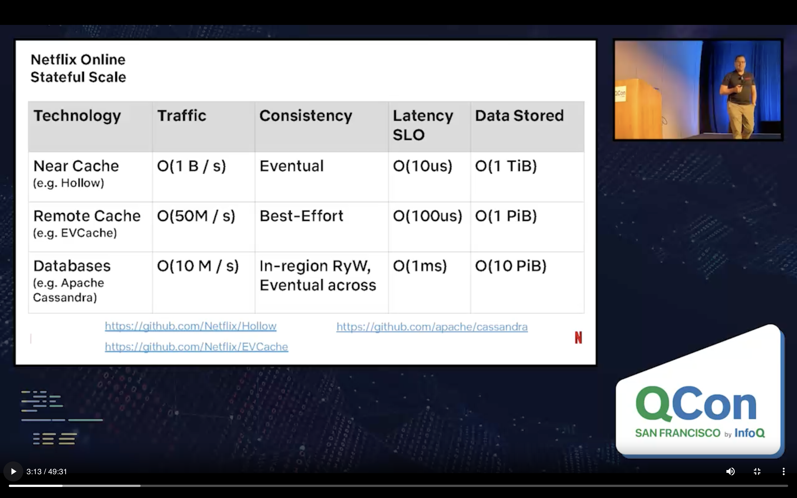
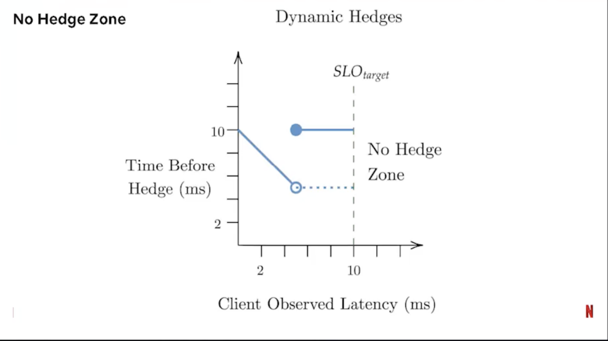
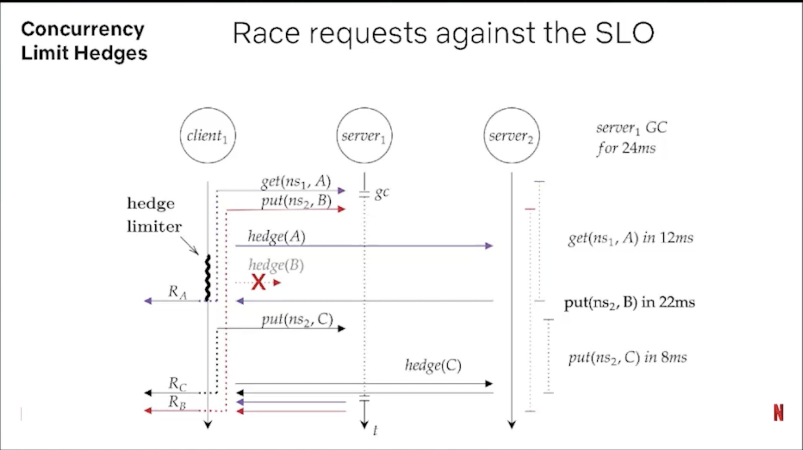

- [How Netflix Ensures Highly-Reliable Online Stateful Systems](https://www.infoq.com/presentations/netflix-stateful-cache/#:~:text=At%20Netflix%2C%20we've%20used,Fewer%20bytes%20is%20more%20reliable.)
	- reliability: read and write operations **succeed** with the **expected consistency** model, within the designated **latency SLO** at **all** times.
	- why nines are
		- TBF, blast radius, TTR
		- failure modes
			- fails just a little bit all the time, it never recovers: request hedging, or improving our tests to cover some bug
			- occasionally fails cataclysmically. When service B fails, it recovers quickly but it still has a near 100% outage during that period.: load shedding or backpressure techniques
			- rarely fails, but when it does fail, it fails for a really long time: alerting or failover support, bulkhead
	- netflix
	  
	- reliable stateful server
		- five concepts
			- sharding,
			- capacity planning,
				- Service Capacity Modeling, automatic capacity planning
					- workload models
					- tier-3 datastores: save money on tier-3s, and tier-2s, spend it on our tier-0s. tier-0 datastores are overprovisioned relative to expected workload.
					- spend on stateful, save on stateless
			- rapid responses via rapid upgrades,
			- cache in front of services
			- use total near-cache
	- reliable stateful client
		- signalling: send signals from server to client. At Netflix, we've used LZ4 compression from our stateful clients to compress large payloads before they're sent. In practice, this reduces bytes sent by between 2x and 3x. Fewer bytes is more reliable.
		- service level objectives per namespace and access pattern,
		- hedged requests,
		  
			- concurrent limit hedges
			  
			- GC tolerant timeouts
		- exponential backoff,
		- load unbalancing, and
		- concurrency limits
	- reliable stateful API
		- idempotency
		- fixed units of work
		- examples:
			- keyvalue abstraction
			- timeseries abstraction