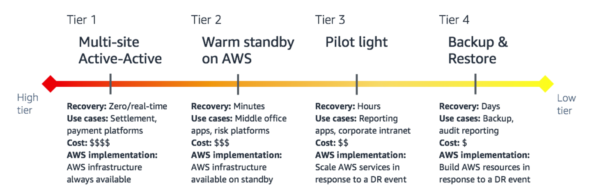

- [Building Mission-Critical Financial Services Applications on AWS](https://d1.awsstatic.com/Industries/Financial%20Services/Overview/Resilient%20Applications%20on%20AWS%20for%20Financial%20Services.pdf)
	- |KPI |Platinum or Tier 1| Gold or Tier 2| Silver or Tier 3 |Bronze or Tier 4|
	  |RTO| 2 hours |< 8 hours| 24 hours |48+ hours|
	  |RPO |< 30 seconds| < 4 hours |24 hours |72 hours|
	  |Availability| 99.99%+| 99.9%| 98% |95%|
	- {:height 339, :width 980}
	- Application Failure
- 