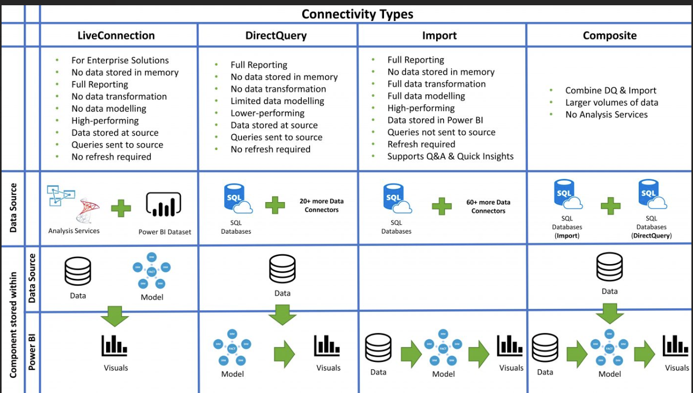

- Enhanced compute engine: an advanced feature available with Power BI Premium. The enhanced compute engine improves performance of linked tables (within the same workspace) that reference (link to) the dataflow. To get [maximum benefit](https://learn.microsoft.com/en-us/power-bi/transform-model/dataflows/dataflows-premium-features) from the enhanced compute engine
	- Split out the staging and transformation dataflows.
	- Use the same workspace to store the staging and transformation dataflows.
	- Apply complex operations that can [query fold](https://learn.microsoft.com/en-us/power-query/power-query-folding) early in the query steps. Prioritizing foldable operations can help to achieve the best refresh performance.
	- Use [incremental refresh](https://learn.microsoft.com/en-us/power-bi/transform-model/dataflows/dataflows-understand-optimize-refresh) to reduce refresh durations and resource consumption.
	- Perform testing early and frequently during the development phase.
- Large datasets in Power BI Premium
- transformation?
- Connectivity Types
  {:height 590, :width 1005}
-