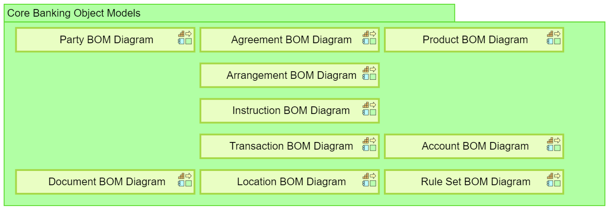
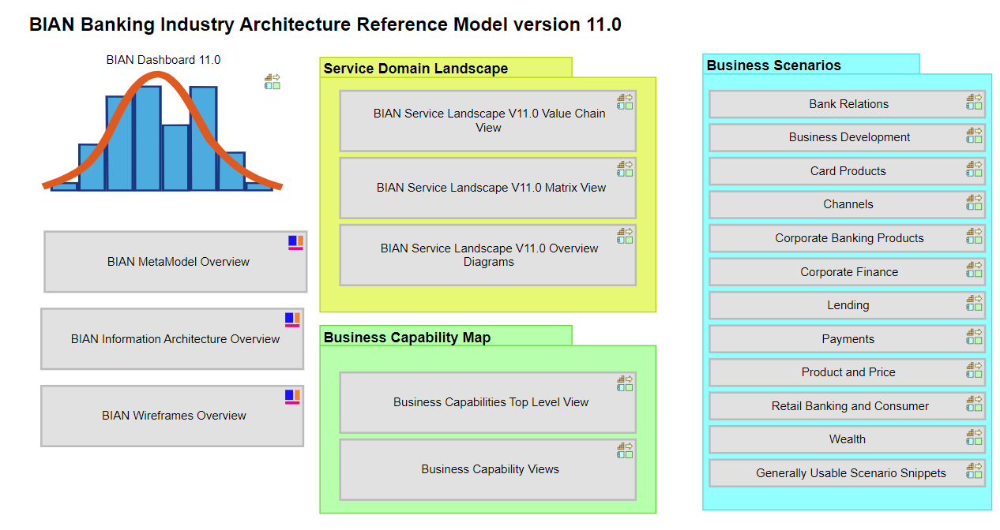
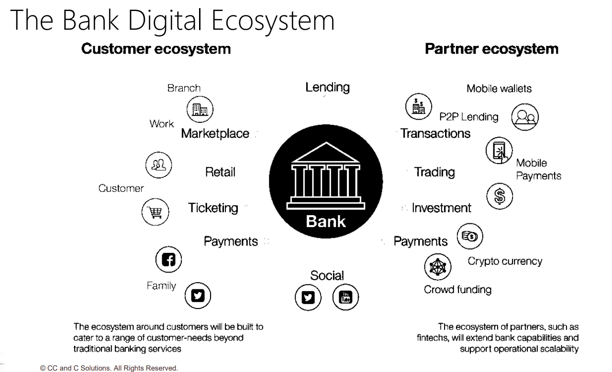
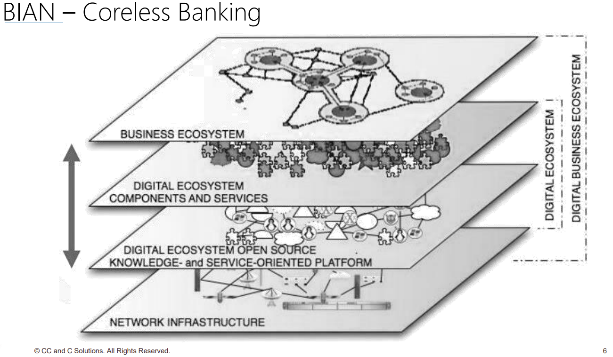
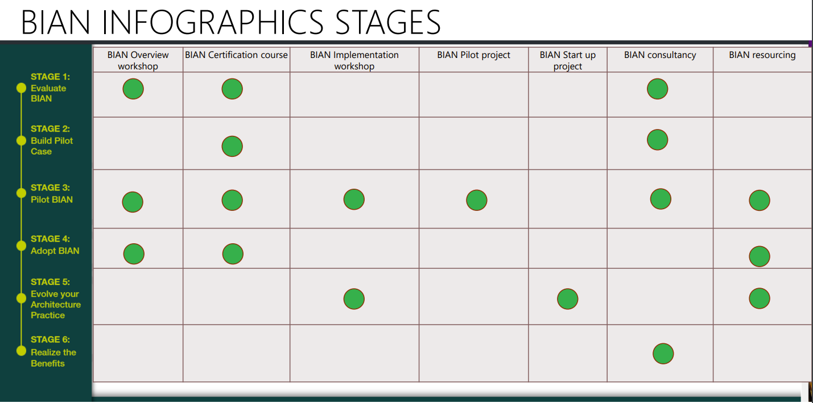
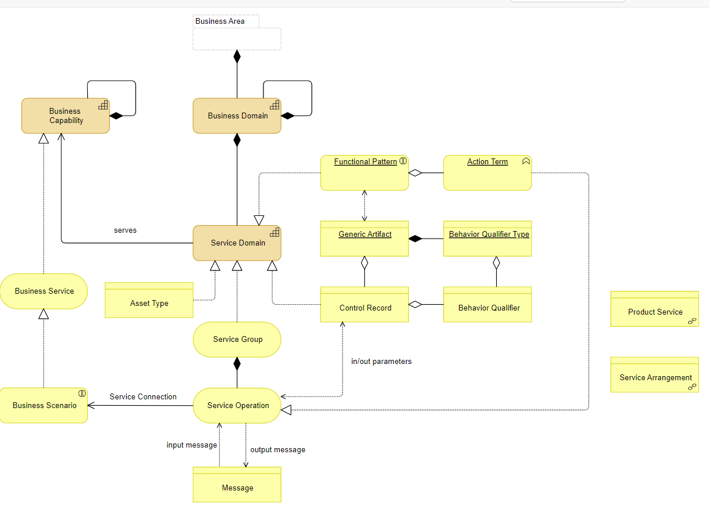

- curr version: v11
- [portal](https://portal.bian.org/dashboard)
- [BIAN Semantic APIs](https://bian.org/semantic-apis/)
	- [How to Use The Semantic API Portal](https://bian.org/semantic-apis/semantic-api-portal-help/)
- BIAN Guidance
	- [A guide to adoption](https://view.ceros.com/hotwirepr/bian-guide-to-adoption/p/1)
	- [White papers](https://bian.org/deliverables/white-paper/)
	- [BIAN in practice Case studies](https://bian.org/deliverables/case-studies/)
- Core Banking Renewal
- Service Group #card
  card-last-interval:: 111.96
  card-repeats:: 5
  card-ease-factor:: 3
  card-next-schedule:: 2024-04-08T00:54:21.395Z
  card-last-reviewed:: 2023-12-18T01:54:21.395Z
  card-last-score:: 5
	- Business Management
	- Finance And Risk Management
	- Resource Management
	- Operations
	  background-color:: blue
	- Products
	  background-color:: blue
	- Customers
	  background-color:: blue
	- Channels
	  background-color:: blue
	- Business Development
- Core Banking Object Model #card
  card-last-interval:: 143.75
  card-repeats:: 5
  card-ease-factor:: 3.3
  card-next-schedule:: 2024-07-23T07:38:36.158Z
  card-last-reviewed:: 2024-03-01T13:38:36.159Z
  card-last-score:: 5
	- 
- concepts:
	- Business Scenarios: show “happy paths” through the business interactions between Service Domains to achieve a particular business goal.
- MessageModeler_UserGuide_v3.0.docx: The tool can upload and compare any proprietary model to the BIAN Semantic API Specification through simplified mapping capabilities between the BIAN model and the core systems of the organization. Users can also introduce additional attributes that are not currently defined as part of the BIAN model as an extension.
- **business areas** #card
  card-last-interval:: 111.96
  card-repeats:: 5
  card-ease-factor:: 3
  card-next-schedule:: 2024-04-08T00:54:29.661Z
  card-last-reviewed:: 2023-12-18T01:54:29.661Z
  card-last-score:: 5
	- **Reference Data**: contains all categories of managed business reference information, covering subjects including customer details, business partner details and product details. In the case of products it includes aspects of product design, development and quality assurance. It also covers market data feeds for general research and analysis and the range of more specialized trading support market information feeds. This reference information is widely accessed across other activities of the landscape.
	- **Sales and Service**: covers all marketing, business development, customer management and sales and servicing activities. It excludes the fulfillment activities associated with in-force product delivery but includes all customer agreement related activities.
	- **Operations and Execution**: includes the full range of product fulfillment activities for wholesale and retail banking, including shared operational capabilities and all front, middle and back office activities.  This is probably excessive in scope and so needs to be divided into several new areas.  There are currently 4 'sub areas' as working places to group the current range of domains in - **Retail Products**, **Wholesale Products Front/Middle Office**, **Wholesale Products Back Office**, **Central Operations**.
	- **Risk and Compliance**: covers the analysis and management of business risk, covering group treasury, asset and liability policies, product and market activities. It includes the handling of regulatory compliance and reporting obligations.
	- **Business Support**: spans a wide range of general business management and support activities that may be found in any commercial business and that are therefore not specific to Banking. This area of the Landscape is included for completeness as many banking specific business activities may need to make reference to these more **general capabilities**.
- {:height 430, :width 795}  )
- [An Introduction to BIAN Adoption Journey](https://bian.org/wp-content/uploads/2021/05/CCC_An-Introduction-to-BIAN-Adoption-Journey_2021.pdf)
	- The Bank Digital Ecosystem
	  {:height 542, :width 650}
	- BIAN – Coreless Banking
	  {:height 442, :width 669}
	- BIAN INFOGRAPHICS STAGES
	  {:height 380, :width 659}
- [A guide to adoption](https://view.ceros.com/hotwirepr/bian-guide-to-adoption)
	- STAGE 1:Evaluate BIAN
		- Assess your needs
		- Conduct a GAP Analysis
		- Determine the Value Proposition
	- STAGE 2:Build Pilot Case
		- Identify key opportunities
		- Identify stakeholders
		- Define pilot goals, scope & timelines
		- Receive go/no-go decision for pilot
	- STAGE 3:Pilot BIAN
		- Prepare for the Pilot
		- Execute the Pilot
		- Make a Recommendation
		- Receive go/no-go decision for BIAN rollout
	- STAGE 4:Adopt BIAN
		- Define your Adoption approach
		- Manage your Change
		- Create a framework for BIAN Adoption
	- STAGE 5:Evolve your Architecture Practice
		- Develop an organization-specific Architecture
		- Continuously improve your Architecture Practice
	- STAGE 6:Realize the Benefits
		- Define Metrics
		- Measure & Report
-  [[hls__BIAN-Semantic-API-Pactitioner-Guide-V8.1-FINAL_1694794476892_0]]
	- 1. Introduction
		- BIAN standard defines a **component** business blueprint for banking.
		- **BIAN approach**
	- 2. Some key BIAN Design considerations
		- Why bother with BIAN
		- Asset Leverage Model View
			- two aspects:
		- Component Vs Process Business Designs
		- componentization vs service enablement
	- 3. design artifacts
		- service landscape
		- Functional Patterns
		  [:span]
		- BIAN Functional Pattern Generic Artifacts
		  ((65056e2b-e628-4a4a-b506-d1086919c517))
		- Top Level BIAN Asset Types
		  [:span]
		- **Right sizing** is key to ensure the defined Service Domains are ‘elemental’ – meaning that a bank either needs the Service Domain in its entirety or it does not, i.e. it can’t split the Service Domain to adopt only some subset of its core function. Defining elemental Service Domains is necessary for the BIAN standard to be canonical: i.e. designs that are consistently interpreted in different deployments. (If it is possible to apply just part of a component its specification quickly ceases to be standard...)
		- Operational Vs Utility re-use
		- functional pattern  vs action terms: In other words, a functional pattern describes what a service domain does, while an action term describes how it does it.
		- first order connections
		- 3.2.6 service domain first order connections
		- 3.2.7 The Information Profile however describes the complete make-up of the business information governed by any Service Domain when implemented as a stand-alone service center.
		- 3.3 Business Scenarios
			- properties: bounded, meanful, non-prescriptive, loose coupled, non-exhaustive, non-redundant
			- Business Scenarios vs conventional process: The key difference as noted is that the sequence of exchanges is
			  not tightly coupled in the scenario – exchanges can be triggered as and when and there
			  is no assumed start/end dependency implied in the scenario.
		- 3.4 wireframe: The BIAN Wireframe shows the available (first order) service connections between a related collection of Service Domains. static view
		- 3.5 Semantic APIs (REST Mapping and the BIAN Semantic API Portal)
			- application boundary (the “A”)
			- program interfaces (the “PI”s)
			- REST constraints and archetypes (Document, collection, store, controller)
			- Service Operation to Endpoint Alignment: In order to align to REST the BIAN service operation action terms that
			  characterize the expected service response have been converted to their noun form
		- 3.6 Service Domain Event Triggering (Proposed design extension)
	- 4 – Implementation Approaches
		- 4.1 Key Properties of Component Design
			- 4.1.1 Components & The Main Driver for Componentization
				- Operational reuse vs utility reuse
			- 4.1.2 Information Architecture - Contrasting Component & Process Approaches
				- Contrasting the Potentially Conflicting Issues of Performance and Consistency
			- 4.1.3 Communications – Component Support for Standard Services
		- 4.2 Adding Implementation Detail
			- 4.2.1 Conceptual Requirements: ISO20022 Mapping
			- 4.2.2 Logical Designs
				- Externalization
				- Logical Design Extensions
				- Organizational Configurations of a Service Domain
				- Application Clusters
			- 4.2.3 Physical Specifications
		- 4.3 Implementation Approaches
			- 4.3.1 Legacy Wrapping Approaches
			- 4.3.2 General Approaches (for legacy wrapping & greenfield development)
				- Shared Platform to Eliminate Service Exchanges
				- Shared Platform to Support Consolidated Cross-Service Domain Reporting
				- BIAN Type 1,2 & 3 external access governance patterns
				- BIAN External Access Framework
- 
	- BIAN How-to Guide – Design Principles & Techniques
	- BIAN How-to Guide – Developing Content
	- BIAN How-to Guide – Applying the BIAN standard
- reference model
  {:height 273, :width 661}
	- Control Records: The *Control Record* is defined as the combination of the asset type and the generic artifact that characterizes the functional pattern of the Service Domain. The *Control Record* is comprised of all the business information governed by the Service Domain as it completes a full cycle of its work. For example, for *Current Account* Service Domain, the asset type is *Current Account*, and the generic artifact for *Fulfill* functional pattern is *Arrangement*; therefore, the Control Record is *Current Account Arrangement*.
	- Behavior Qualifiers: A further level of breakdown for the Control Record is often required to define a sufficiently narrow business context. The *Behavior Qualifier* is introduced to characterize the finer grained activity that is a part of the overall work done by a functional pattern. The *Behavior Qualifier* retains the core behavioral characteristics of its associated functional pattern. For example, for *Current Account* Service Domain, Behavior Qualifiers such as *Direct Debit*, *Deposits*, *Withdrawals*, and *Payments* are used to describe the specific features of the Service Domain characterized by the *Fulfill* functional pattern. Additional levels of breakdown can be applied consistently as needed.
	- **Information Profile and Business Object Model **In addition to the Control Record instances (and the contained Behavior Qualifier instances), *Information Profile *contains information used in the control and management of the Service Domain as a service center and the analysis and reporting of usage and performance of the Control Record instances the Service Domain manages. Using the modeling approach for *Information Profile*, the recent BIAN *Business Object Model (BOM)* provides a more precise conceptual basis to describe the business semantics and data of BIAN Service Domains. The BOM contains models for a growing number of Service Domains, Control Records, and mappings to ISO20022 business components and elements.
	- **Service Operation and Service Group**: A Service Domain offers a collection of service operations and usually consumes the service operations of other Service Domains as needed to complete its work. BIAN defines the *Service Operation* to indicate a service dependency between Service Domains. BIAN defines a general set of ***action terms*** that characterize the purpose of an offered service. These action terms can be grouped into categories. A Service Operation specification is defined using the applicable action term and optionally a behavior qualifier, with payload specified as an organized list of semantic attributes (as BOMs) covering the key business information provided and returned for the service exchange. The *Service Operations* are grouped into *Service Groups* based on the categories of the action terms..
	- Value Stream to Business Scenario Mapping
	-
- composable banking
- BIAN’s Coreless Banking platform:
	- develop API-based micro-services
	- permit the following functions:
		- Complete plug and play functionality, to ensure no impact to user experience
		- Fully deployable to the cloud, so users can take advantage of modern software development techniques
		- Bank consumable API interface to orchestrate (where necessary) BIAN APIs and reduce network traffic
		- Cross domain orchestration to also reduce network traffic
- banking systems (CBS)
- coreless banking:
	- Key Features
	- use cases
	- Outlook and Trends
- meta model
  {:height 544, :width 737}
- [BIAN Applied to Microservices: Mapping to Domain-Driven Design](https://biaohao.medium.com/bian-applied-to-microservices-mapping-to-domain-driven-design-5aa6a55185c7) #inbox
	- Mapping Between BIAN and DDD
	  {:height 386, :width 700}
	- |BIAN | DDD|
	  |-- | --|
	  | Service Domains | Bounded Contexts |
	  |Control Records and Behavior Qualifiers| Aggregates |
	  | Service Operations and Service Groups | Services and Service Objects|
	  | Events  | Domain Events|