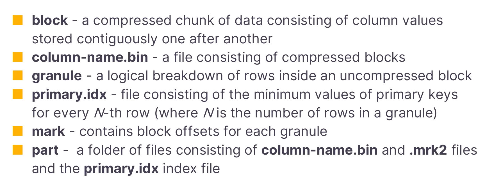

- Vector Search
- log analytics
- best practices #best-practices
	- Avoid nullable columns
	- [async_insert](https://clickhouse.com/docs/en/optimize/asynchronous-inserts)
		- ClickHouse to create the batches, then you can use the asynchronous INSERT mode
- [ClickHouse Playground](https://play.clickhouse.com/play?user=play)
- [Handling Updates and Deletes in ClickHouse](https://clickhouse.com/blog/handling-updates-and-deletes-in-clickhouse)
	- Mutations
		- Updating Data using Mutations
		  ``` sql
		  ALTER TABLE table
		      UPDATE col1 = 'Hi' WHERE col2 = 2
		  ```
		- updating data is a heavy query because ClickHouse has to do a lot of work to optimize storage and processing. A mutation operation forces all data parts containing those rows to be deleted to be re-written, with the target rows excluded when forming the new part. This can cause considerable I/O and cluster overhead, so use this with caution or consider the alternatives discussed below.
		- Deleting Data using mutations
		  ``` sql
		  ALTER TABLE table
		      DELETE WHERE col2 = 3
		  ```
		- Checking Mutation Progress
		  ``` sql
		  SELECT
		      command,
		      is_done
		  FROM system.mutations
		  WHERE table = 'tablename'
		  ```
		- Synchronous Updates
		  ``` sql
		  SET mutations_sync = 1
		  ```
		- Updating an Entire Table:
		- ClickHouse won't let you update an entire table because updates are heavy.
			- One way to force ClickHouse to accept this operation is with an always-true filter:
			  ```sql
			  ALTER TABLE table
			      UPDATE col1 = 'bye' WHERE true
			  ```
			- However, a more optimal approach is to create a new column with the new value as the default and then switch the old and new columns.
		-
- [Using Materialized Views in ClickHouse](https://clickhouse.com/blog/using-materialized-views-in-clickhouse)
	- join
		- a materialized view only triggers when its source table receives inserts. It's just a trigger on the source table and knows nothing about the join table. Note that this doesn't only apply to join queries, and is relevant when introducing any table external in the materialized view's SELECT statement e.g. using a `IN SELECT`.
		- consider to use dictionary
		- [Projections and Materialized Views](https://www.tinybird.co/blog-posts/projections#projections-and-materialized-views)
- paste join: a horizontal concatenation of two tables in ClickHouse
- [Using Dictionaries to Accelerate Queries](https://clickhouse.com/blog/faster-queries-dictionaries-clickhouse)
- blogs:
	- [Building ClickHouse Cloud From Scratch in a Year](https://clickhouse.com/blog/building-clickhouse-cloud-from-scratch-in-a-year)
- courses
	- [ClickHouse Developer: Learning Path](https://learn.clickhouse.com/learner_course/show/1049584) #course
		- 3. Clickhouse architecture
			- Data Storage
			  {:height 205, :width 534}
			- Choosing a primary key
			- partition
		- 4. [Data Ingestion](https://learn.clickhouse.com/learner_module/show/1049584?lesson_id=5638850&section_id=44367430)
			- Insert data from a file
				- **Table functions and inferring schema**
					- **input_format_max_rows_to_read_for_schema_inference**
				- Nullable, LowCardinality, enumeration
			- Insert data from an external database
				- table functions
			- Using Table Functions and Engines
		- collapsed:: true
		  5.  [Deduplication](https://learn.clickhouse.com/learner_module/show/1049584?lesson_id=5642803)
			- Overview
			  collapsed:: true
				- not immediate; **eventual**
				- side effects
					- at any moment, still have duplicates (rows with the same sorting key)
					- The actual removal of duplicate rows occurs during the merging of parts.
					- queries need to allow for the possibility of duplicates
				- options:
					- ***ReplacingMergeTree***: either force a merge before running (using the ***FINAL*** clause - which is not typically recommended) or use a timestamp field to retrieve the latest value (using a function like ***argMax***)
					- Colllapsing rows (***CollapsingMergeTree*** & ***VersionedCollapsingMergeTree***): a **"sign" column** of type ***Int8*** that is set to either 1 or -1. To cancel a row, you insert the same data but change the sign column to -1. This requires you to know the previous state of a row so you can cancel it, but the benefit is that it is easy to find the current state of a row.
			- Implementing Deduplication with ReplacingMergeTree
				- FINAL
				- Avoiding merges:
					- group by , max
					- a timestamp field can often be used to quickly retrieve the "latest" row inserted. If parallel inserts are occurring and/or if a timestamp field does not ensure what is meant by the latest row, then consider using a version column
				- version column: a column of type unsigned integer, date, or timestamp.
			- Implementing Deduplication with CollapsingMergeTree
			- Implementing Deduplication with VersionedCollapsingMergeTree
		- collapsed:: true
		  6. [Materialized view](https://learn.clickhouse.com/learner_module/show/1049584?lesson_id=5638851)
			- extra reading: https://clickhouse.com/blog/using-materialized-views-in-clickhouse
			- views: normal and materialized view
			- materialized views
				- Two ways to define a materialized view
					- Let ClickHouse define the underlying table:  prefix: ***.inner.***
					- Define the underlying table before creating the view; then use the ***TO*** clause to specify your underlying table when defining the view
				- Populating a view
					- insert vs populate
					- When using the **TO** clause, you cannot use **POPULATE AS**
				- best practices
					- Avoid using ***POPULATE*** unless you are working on small datasets or are still in the development phase.
					- Define a table for storing the data in your materialized views - using the ***TO*** clause in the definition of the view.
					- Either pause inserts to populate a view or use a timestamp column to cleverly ensure all rows are inserted into your view.
			- Summing columns
			  collapsed:: true
				- **SummingMergeTree **
					- Because our **SummingMergeTree** table consists of two parts that have not been merged yet. When querying a **SummingMergeTree** table, you should allow for the possibility of multiple parts/partitions and therefore perform a grouping and calculate the sum of each group
				- **Summing by date ranges (histograms)**: GROUP BY
			- Aggregating columns
			  collapsed:: true
				- **AggregatingMergeTree **
				- **state functions**: created by appending **SimpleState** or **State** to the end of a ClickHouse function
				- **SimpleState Combinators**: special data types used in ***AggregatingMergeTree*** tables. Here is a list of all the ClickHouse functions that can be appended with **SimpleState** for use in an **AggregatingMergeTree** table
				  
				  The values stored in these data types can be retrieved by simply selecting the column, which is not the case for **State** combinators (discussed next), which require a special **Merge** combinator to view the data.
				- **State Combinators**: appended with **State**
					- **Viewing state data types**: use the **Merge** combinator by appending **Merge** to the function name
					  ``` sql
					  SELECT
					      avgMerge(avg_metric1),
					      avgMerge(avg_metric2),
					      uniqMerge(user_count)
					  FROM daily_totals
					  ```
		- collapsed:: true
		  7. [Projections](https://learn.clickhouse.com/learner_module/show/1049584?lesson_id=5638852)
			- overview
				- store data in different ways for a table
				- vs materialized view
					- it stores the same data of a single table but in a different sort order (or in some other way that you define)
					- the projected data is stored at the part level and is actually saved in a subfolder of each table's part
				- benefits
					- multiple projections
					- ClickHouse determines at query time if a query will benefit from using a projection vs. the original sort order (by determining which option processes the **fewest granules**)
				- costs
					- store twice(may more, depends how many projections), tradeoff between storage and the gain in performance
					- inserts can take slightly longer since the data is written twice
			- define projections
				- Defining a projection in a new table: ***PROJECTION*** clause in ***CREATE TABLE*** command
				  ``` sql
				  CREATE TABLE hackernews2 (
				      id UInt32, 
				      type LowCardinality(String), 
				      author String, 
				      timestamp DateTime, 
				      comment String, 
				      children Array(UInt32),
				      PROJECTION author_projection (
				        SELECT * ORDER BY author
				      )
				  ) 
				  ENGINE = MergeTree 
				  PRIMARY KEY (type, toYYYYMMDD(timestamp))
				  ```
				- Add a project to an existing table: ***ALTER TABLE***
				  ``` sql
				  ALTER TABLE hackernews2
				  ADD PROJECTION author_count_projection
				     (
				        SELECT 
				           author, 
				           count() AS count
				        GROUP BY
				           author
				     )
				  ```
				- ***MATERIALIZE PROJECTION***
				  ``` sql
				  ALTER TABLE hackernews2 MATERIALIZE PROJECTION author_count_projection
				  ```
		- collapsed:: true
		  8. [TTL: Managing Old Data](https://learn.clickhouse.com/learner_module/show/1049584?lesson_id=5798314&section_id=44367440)
			- Overview of TTL
			  collapsed:: true
				- Use case for TTL: removing old data, move data between disks ( hot/warm/cold architecture), data rollup
				- Syntax
					- appear after a column definition and at the end of the table definition
					- Use the ***INTERVAL*** clause to define a length of time (which needs to be a Date or DateTime data type)
					- When the interval lapses, the column expires. ClickHouse replaces the column value with the default value of its data type. If all the column values in the data part expire, ClickHouse deletes this column from the data part in the filesystem.
					- interval vs ***toInterval***
				- **Altering or Adding a TTL Rule**
					- alter a table to add a rule to a column or to the entire table
					- not applied to the existing rows in the table.
					- materialize: the actual deletion of rows does not happen until its parts get merged.
					  ``` sql
					  ALTER TABLE example1 MATERIALIZE TTL
					  ```
				- Triggering TTL Events
					- `merge_with_ttl_timeout`: the minimum delay in seconds before repeating a merge with **delete TTL**. The default is 14400 seconds (4 hours).
					- `merge_with_recompression_ttl_timeout`: the minimum delay in seconds before repeating a merge with **recompression TTL **(rules that roll up data before deleting). Default value: 14400 seconds (4 hours).
					- force a merge using ***OPTIMIZE***: ***FINAL*** forces a reoptimization if your table is already a single part.
					  ``` sql
					  OPTIMIZE TABLE example1 FINAL
					  ```
			- Removing old data
			  collapsed:: true
				- row: define the TTL rule at the table level
				- column:
			- Rolling up data
			  collapsed:: true
				- adding a ***GROUP BY*** clause to ***TTL*** expression, along with some columns in your table to store the aggregated results.
				  ``` sql
				  CREATE TABLE hits (
				     timestamp DateTime,
				     id String,
				     hits Int32,
				     max_hits Int32 DEFAULT hits,
				     sum_hits Int64 DEFAULT hits
				  )
				  ENGINE = MergeTree
				  PRIMARY KEY (id, toStartOfHour(timestamp), timestamp)
				  TTL timestamp + INTERVAL 15 SECOND
				      GROUP BY id, toStartOfHour(timestamp)
				      SET 
				          max_hits = max(max_hits),
				          sum_hits = sum(sum_hits);
				  ```
			- Moving data
				- ***TO DISK*** and ***TO VOLUME*** clauses of the ***TTL*** command
				  ``` sql
				  ALTER TABLE crypto_prices
				     MODIFY TTL 
				        trade_date TO VOLUME 'hot_volume',
				        trade_date + INTERVAL 2 YEAR TO VOLUME 'warm_volume',
				        trade_date + INTERVAL 4 YEAR TO VOLUME 'cold_volume';
				  ```
				- disks: point to folders that ClickHouse can read from and write to
				- volumes: contain one or more disks
				- ClickHouse configuration files: ***my_system.xml*** (or any file name)
				  ``` xml
				  <clickhouse>
				      <storage_configuration>
				          <disks>
				             <hot_disk>
				                <path>./data/hot/</path>
				             </hot_disk>
				             <warm_disk>
				                <path>./data/warm/</path>
				             </warm_disk>
				             <cold_disk>
				                <path>./data/cold/</path>
				             </cold_disk>
				          </disks>
				          <policies>
				              <my_policies>
				                  <volumes>
				                      <hot_volume>
				                          <disk>hot_disk</disk>
				                      </hot_volume>
				                      <warm_volume>
				                          <disk>warm_disk</disk>
				                      </warm_volume>
				                      <cold_volume>
				                          <disk>cold_disk</disk>
				                      </cold_volume>
				                  </volumes>
				              </my_policies>
				          </policies>
				      </storage_configuration>
				  </clickhouse>
				  ```
	- [Performance introspection EXPLAIN clause](https://learn.clickhouse.com/learner_module/show/1064019?lesson_id=5731083&section_id=44147065) #course
	- [ClickHouse at Scale](https://learn.clickhouse.com/learner_module/show/1064045?lesson_id=5731267&section_id=44147061) #course
		- cluster architecture (shard and replications)
			- scale up vs scale out
			- distributed tables
			- shard, replica
			- clickhouse keeper (zookeeper)
		- cluster configuration (how to archive a sharded and replicated set-up)
			- Distributed DDL Queries (ON CLUSTER Clause)
			  ``` sql
			  CREATE TABLE IF NOT EXISTS all_hits 
			     ON CLUSTER cluster (p Date, i Int32) 
			     ENGINE = Distributed(cluster, default, hits)
			  ```
			- keeper clusters options
			- how to query underlying tables (remote table), connect to remote server and query them
	- [Materialized Views and Projections Under the Hood](https://learn.clickhouse.com/learner_module/show/1070516?lesson_id=5792541&section_id=44125182) #course