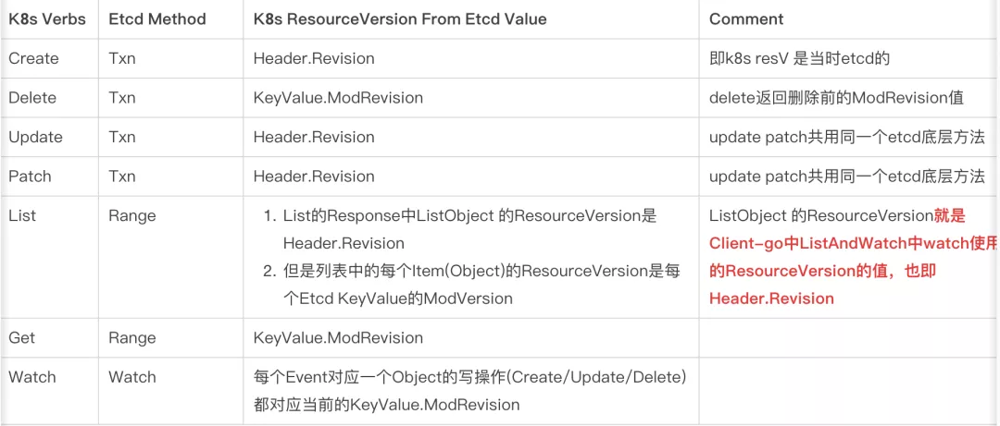

- bbolt
- proxy vs proxy-less
- [Etcd Backup And Restore In Kubernetes: Step By Step Guide](https://k21academy.com/docker-kubernetes/etcd-backup-restore-in-k8s-step-by-step)
	- How to backup the Etcd & Restore it
		- Taking Snapshot and Verifying it
		  ``` bash
		  ETCDCTL_API=3 etcdctl snapshot save snapshot.db \
		  --cacert /etc/kubernetes/pki/etcd/ca.crt \
		  --cert /etc/kubernetes/pki/etcd/server.crt \
		  --key /etc/kubernetes/pki/etcd/server.key \
		  --endpionts=https://127.0.0.1:2379
		  ```
		- Verifying: View that the snapshot was successful
		  ``` bash
		  ETCDCTL_API=3 etcdctl snapshot status snapshot.db
		  ```
		- Backing-up The Certificates And Key Files
		  ``` bash
		   tar -zcvf etcd.tar.gz /etc/kubernetes/pki/etcd
		  ```
- [Tuning](https://etcd.io/docs/v3.6/tuning/)
	- Time parameters
		- *Heartbeat Interval*
		- *Election Timeout*
		- ``` bash
		  # The values are specified in milliseconds.
		  
		  # Command line arguments:
		  $ etcd --heartbeat-interval=100 --election-timeout=500
		  
		  # Environment variables:
		  $ ETCD_HEARTBEAT_INTERVAL=100 ETCD_ELECTION_TIMEOUT=500 etcd
		  ```
	- Snapshots
	  ``` bash
	  # Command line arguments:
	  $ etcd --snapshot-count=5000
	  
	  # Environment variables:
	  $ ETCD_SNAPSHOT_COUNT=5000 etcd
	  ```
	- disk: 
	  
	  ``` bash
	  # best effort, highest priority
	  $ sudo ionice -c2 -n0 -p `pgrep etcd`
	  ```
	- network: 
	  If the etcd leader serves a large number of concurrent client requests, it may delay processing follower peer requests due to network congestion. This manifests as send buffer error messages on the follower nodes:
	  ```
	  dropped MsgProp to 247ae21ff9436b2d since streamMsg's sending buffer is full
	  ```
	  These errors may be resolved by prioritizing etcd’s peer traffic over its client traffic. On Linux, peer traffic can be prioritized by using the traffic control mechanism:
	  
	  ``` bash
	  tc qdisc add dev eth0 root handle 1: prio bands 3
	  tc filter add dev eth0 parent 1: protocol ip prio 1 u32 match ip sport 2380 0xffff flowid 1:1
	  tc filter add dev eth0 parent 1: protocol ip prio 1 u32 match ip dport 2380 0xffff flowid 1:1
	  tc filter add dev eth0 parent 1: protocol ip prio 2 u32 match ip sport 2379 0xffff flowid 1:1
	  tc filter add dev eth0 parent 1: protocol ip prio 2 u32 match ip dport 2379 0xffff flowid 1:1
	  ```
	- cpu
	  
	  ``` bash
	  echo performance | tee /sys/devices/system/cpu/cpu*/cpufreq/scaling_governor
	  ```
- [The Implicit Kubernetes-ETCD Contract](https://docs.google.com/document/d/1NUZDiJeiIH5vo_FMaTWf0JtrQKCx0kpEaIIuPoj9P6A/edit?pli=1)
- Tales from on-Call: Fun with Operating Etcd at Scale - Geeta Gharpure & Chao Chen, Amazon
	- etcd @ EKS
		- 1. Each etcd cluster is a 3 node cluster
		- 2. kube-apiserver uses auto-sync to update etcd server endpoints with its latest membership
		- 3. EKS etcd supports version downgrade from 3.5 to 3.4
		- 4. etcd runs as a systemd daemon service
		- 5. etcd operator runs in the same box as etcd
	- Etcd database size quota breach
		- 8 GB quotas
	- Revision divergence
		- impacts:
			- Core k8s components fail to acquire the lease and stop functioning
	- Out of memory
		- reasons
			- Unpaginated requests
			- Workload spikes too much too fast.
			- Every req is new allocation – GC is asynchronous
		- mitigation:
			- client side pagination in apiserver, (**Etcd Client Side Changes for Range Requests**)
			- etcd server side throttle
	- Timeouts
	- Request size too large
	- defrag vs compact
		- compaction: run every 5 mins by apiserver
		- defrag: run by operator
- Setting up Etcd with Kubernetes to Host Clusters with Thousands of Nodes - M Zięba & L Bernaille
	- {{video https://youtu.be/_Zhf_iJMqwE}}
	- https://static.sched.com/hosted_files/kccnceu2023/f9/Setting%20up%20Etcd%20with%20Kubernetes%20to%20Host%20Clusters%20with%20Thousands%20of%20Nodes.pdf?_gl=1*1mrtq9i*_ga*MTI3MjI0Njk1Mi4xNjg5MDgzODU1*_ga_XH5XM35VHB*MTY4OTk5NDk0NC43LjEuMTY4OTk5NDk2NC4wLjAuMA
	- split controller and scheduler( only one active, lease-election based lead)
	- size the control plane
		- api-server: central components, called from many places
			- cache : list +watch from etcd
		- etcd clusters for different resource types: good disk and net IOs
	- How a single app can overwhelm the control plane
		- KEP-3157: streaming list
		- KEP-1040: API priority and fairness
			- use cases:
				- High churn of events
					- Priority Level with limited concurrency
					- Redirect all event related requests (get/list/watch/create etc) to new Priority Level from all components
				- Misbehaving controller/daemonset etc
					- Create new PriorityLevel with small concurrency
					- Redirect all request of this component to newly created Priority Level
- https://medium.com/paypal-tech/scaling-kubernetes-to-over-4k-nodes-and-200k-pods-29988fad6ed
- [蚂蚁大规模 Sigma 集群 Etcd 拆分实践](https://www.sofastack.tech/blog/ant-massive-sigma-cluster-etcd-splitting-in-practice/)
	- Pod 数据拆分经验流程的问题
		- 人工操作大量组件重启时间长、易出错: 潜在需要重启的组件高达数十个，需要与各个组件 owner 进行沟通确认，梳理出需要重启的组件，需要耗费大量的沟通时间。万一遗漏就可能造成非预期的后果，比如资源残留、脏数据等。
		- 完全停机持续时间长打破 SLO
		- 数据完整性校验手段薄弱:  拆分过程中使用 etcd 开源工具 make-mirror 工具来迁移数据，该工具实现比较简单，就是读取一个 etcd 的 key 数据然后重新写到另一个 etcd，不支持断点续传，同时因重新写入 etcd 造成原有 key 的重要字段 revision 被破坏，影响 Pod 数据的 resourceVersion, 可能会造成非预期后果。关于 revision 后文会详细说明。最后的校验手段是检验 keys 的数量是否前后一致，如果中间 key 的数据被破坏，也无法发现。
		-
	- 问题解析
		- 拆分为 4 个独立的 etcd 集群，分别存储 Pods、Leases、event 和其他资源数据
			- event: event 资源数据本身就是有效期的（默认是 2 小时），除了通过 event 观测资源对象生命周期变化外，一般没有重要的业务依赖，所以说 event 数据一般认为是可以丢弃，不需要保障数据前后一致性的。
			- Lease:
			- Pod 资源
			   {:height 624, :width 524}
		- 重启组件?: api-server, operator
		- Pod 禁写的小坑: MutatingWebhook ( Kyverno policy)
			- Pod status 与 Pod 对于 apiserver 的存储来讲是不同的资源。
			- ``` yaml
			  apiVersion: admissionregistration.k8s.io/v1 
			  kind: MutatingWebhookConfiguration 
			  metadata:
			    name: deny-pods-write
			  webhooks: 
			  - name: always-deny.extensions.k8s
			    admissionReviewVersions: ["v1beta1"]
			    clientConfig: 
			      url: https://extensions.xxx/always-deny 
			    failurePolicy: Fail
			    namespaceSelector: {} 
			    rules: 
			    - apiGroups: 
			       - ""
			      apiVersions: 
			       - v1
			      operations: 
			      - "" 
			      resources: 
			      - pods 
			      - pods/status 
			      - pods/binding 
			      scope: ""
			    sideEffects: NoneOnDryRun
			  
			  ```
	- K8s 中的 resource object 中的 resourceVersion 字段与 etcd 中的各种 Revision 对应关系
	  {:height 302, :width 646}
	- no downtime etcd sharding
	  {:height 489, :width 667}