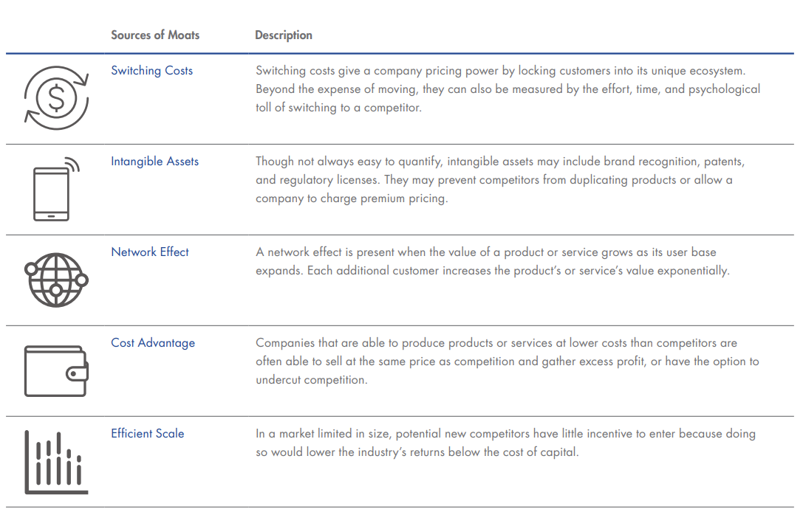

- 
	- A company’s moat refers to its ability to maintain the competitive advantages that are expected to help it fend off competition
	  and maintain profitability into the future
	- {:height 495, :width 669}