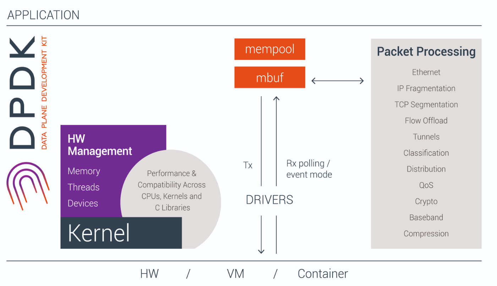

- technologies:
	- zero-copy buffer
	- kTLS
	- sendfile
	- Multipath TCP
	- head-of-line blocking
	- TCP Large Receive Offload (LRO)
- [Quick reference-nftables in 10 minutes](https://wiki.nftables.org/wiki-nftables/index.php/Quick_reference-nftables_in_10_minutes)
- readings
	- [NUMA Siloing in the FreeBSD Network Stack](https://2019.eurobsdcon.org/slides/NUMA%20Optimizations%20in%20the%20FreeBSD%20Network%20Stack%20-%20Drew%20Gallatin.pdf)
	- [Deploying User-space TCP at Cloud Scale with Luna](https://www.usenix.org/system/files/atc23-zhu-lingjun.pdf)
		- LibOS mode, use DPDK
	- [IX: A Protected Dataplane Operating System for High Throughput and Low Latency](https://courses.cs.washington.edu/courses/cse551/15sp/papers/ix-osdi14.pdf)
	- DPDK: a set of libraries and drivers for fast packet processing. DPDK is the Data Plane Development Kit that consists of libraries to accelerate packet processing workloads running on a wide variety of CPU architectures.
		- {:height 541, :width 908}