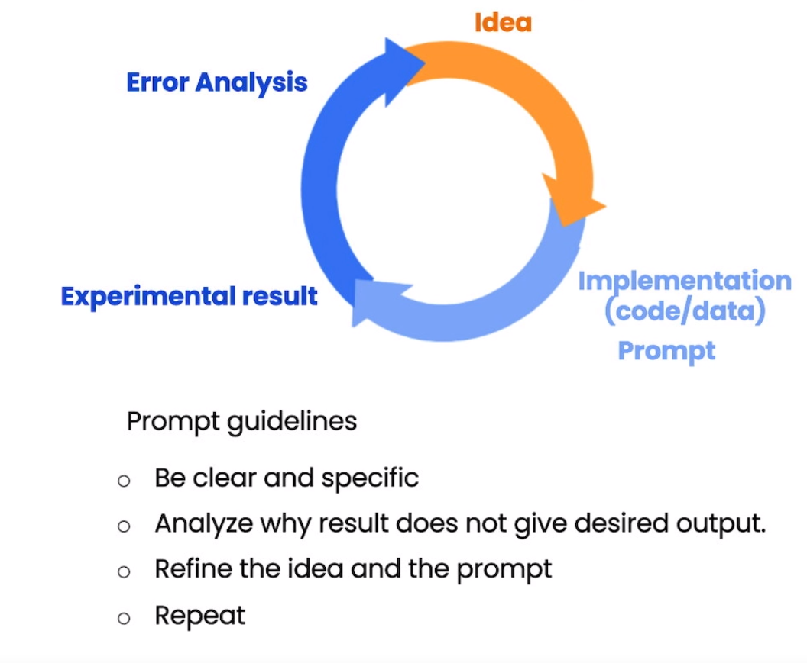

- courses
	- **ChatGPT Prompt Engineering for Developers** 
	  url:: https://learn.deeplearning.ai/chatgpt-prompt-eng
	  date:: 2023-06-03
	  type:: course
	  id:: 647b4dd5-b2eb-461d-9553-e894c29023ce
		- **Introduction**
			- LLM ypes
				- base LLM
				- instruction tuned LLM
					- Reinforcement Learning from Human Feedback (RLHF)
			- use cases: summarizing, inferring, transforming, expanding
			- Prompt Templates
		- Guidelines
			- principle of prompting LLMs
				- write clear and specific instructions
					- clear ≠ short
					- prompt examples of the following tactics
					- tactic 1: Use delimiters: avoid prompt injections
						- Triple quotes: """
						- Triple backticks: ```
						- Triple dashes: ---,
						- Angle brackets: <>
						- XML tags: <tag> </tag>
					- tactic 2: ask for structured output, such as html, json
					- tactic 3: Check whether conditions are satisfied. check assumptions required to do the task
					- tactic 4: few shot prompting
						- give successful examples of completing tasks, then ask model to perform the tasks
				- Give the LLM time to think.
					- tactic 1: specify the steps to complete a task
						- step 1: ...
						- step 2: ...
						- ...
						- step N: ...
					- Tactic 2: Instruct the model to workout its own solution before rushing to a conclusion
					-
			- Model Limitations
				- Hallucination
					- Make statements that sound plausible but are not true
				- Reducing hallucinations: First find relevant information, then answer the question based on the relevant information
		- Iterative Prompt Development
		  collapsed:: true
			- process {:height 306, :width 406}
		- user case: summarizing
			- url: https://towardsdatascience.com/chatgpt-summarization-llms-chatgpt3-chatgpt4-artificial-intelligence-16cf0e3625ce#:~:text=%E2%80%9CExtract%E2%80%9D%20instead%20of%20%E2%80%9CSummarize%E2%80%9D&text=While%20summarization%20aims%20to%20provide,Let's%20try%20then%20with%20extraction!
			- **LLMs often fall short when it comes to adhering to specific character or word limitations** in their summaries.
			- **“Extract” instead of “Summarize”**: While summarization aims to provide a concise overview of the text’s main points including topics non-related to the topic of focus, information extraction focuses on retrieving specific details
		- use case: inferring
			- infer sentiment and topics
			- one API and model for many tasks with prompt,
			- infer vs extract
			- information extraction: part of NLP
		- use case: transformation
			- use Large Language Models for text transformation tasks such as language translation, spelling and grammar checking, tone adjustment, and format conversion.
		- use case: expanding
			- taking a shorter piece of text, such as a set of instructions or a list of topics, and having the large language model generate a longer piece of text.
			- use a large language model as a brainstorming partner
			- temperature:
				- a parameter of the language model, change the kind of variety of the model's responses, the degree of exploration or kind of randomness of the model
				- higher temperatures the assistant is more distractible but maybe more creative.
				- temperature zero: reliable and predictable
		- use case: chatbot
			- chat models like ChatGPT are actually trained to take a series of messages as input and return a model generated message as output.
			- system message, role message, user message, tempature
			- context: all messages
	- **Building Systems with the ChatGPT API**
	  url:: https://learn.deeplearning.ai/chatgpt-building-system
	  date:: 2023-06-04
	  type:: course
	  id:: 647c50d9-d779-42cf-a9f1-bcf368c8f6d3
		- introduction
		- language model, the chat format and tokens
		  id:: 647c512b-962b-4989-8653-b4b1cc34a742
			- tokens:  chatGPT, not based on word and letter, 1 token is  around 4 characters.
			- input context
			- output completion
			- system,user, assistant message
		- evaluate inputs: classification
	- **How Diffusion Models Work**
	  url:: https://learn.deeplearning.ai/diffusion-models
	  date:: 2023-06-4
	  type:: course
		- Introduction
		- intuition
		- sampling
		- neural network
			- Denoising diffusion probabilistic models (DDPMs)
			- denoising diffusion implicit models (DDIMs): a more efficient class of iterative implicit probabilistic models with the same training procedure as DDPMs.
		- training
		- controlling
		- speeding up
		- summary
	- AI4I® – Literacy in AI
	  url:: https://learn.aisingapore.org/courses/ai-for-industry-part-1/
	  date:: 2023-06-06
	  type:: course
- Sites:
	- https://learnprompting.org/
	- https://python.langchain.com/en/latest/index.html