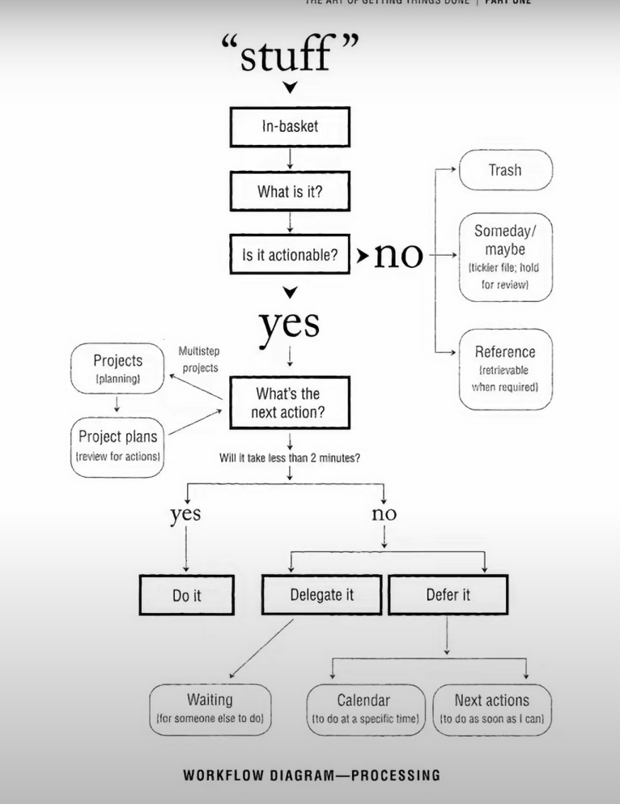

- Cal Newport’s Time-block planner in Logseq {{video https://www.youtube.com/watch?v=D8CRNuuBkoU}}
- Logseq Hypothes.is Plugin: fetch annotations from Hypothes.is as a page
- query: https://docs.datomic.com/pro/query/query.html
- [data log learning](https://www.learndatalogtoday.org/) #card
  card-last-interval:: 111.96
  card-repeats:: 5
  card-ease-factor:: 3
  card-next-schedule:: 2024-03-05T00:51:25.139Z
  card-last-reviewed:: 2023-11-14T01:51:25.140Z
  card-last-score:: 5
	- Transformation functions
	- Aggregate
	- Rules
- install plugins manually
	- install plugins via using logseq in wsl2
	- sync plugins from wsl2 to windows host
- block attrs: https://github.com/logseq/logseq/blob/c67c4aa3c8c05f60cf66f1cb9fd35ae531c60a5f/src/main/frontend/db/model.cljs#L37
- [Change text color for individual blocks or even words](https://discuss.logseq.com/t/change-text-color-for-individual-blocks-or-even-words/20508)
- add checkbox + [ ]
- CRM:
	- link:
		- https://discuss.logseq.com/t/advanced-queries-for-use-with-crm/14379/13
		- https://www.reddit.com/r/logseq/comments/xqmexf/logseq_crm_setup/
	- People have their own pages
	- People pages start with @
	- People pages have a page property contact which lists a contact interval. E.g. weekly.
- logseq Schrödinger: export
- The Refactoring Of Logseq: https://docs.logseq.com/#/page/The%20Refactoring%20Of%20Logseq
- NOTICEs
	- Child blocks inherit any links that their parent block(s) contain.
- [Queries for task management](https://discuss.logseq.com/t/queries-for-task-management/14937)
- Template:
	- links: https://www.appsntips.com/learn/create-use-templates-logseq/#how-to-create-templates-in-logseq
- How to reference blocks
  url:: https://discuss.logseq.com/t/the-basics-of-logseq-block-references/8458#how-to-reference-blocks-2
	- Copying their address
	- Click-dragging them
	- Searching for them
	- In an alias
- GTD
	- GTD1:
	  {:height 800, :width 660}
	- GTD2:
	  {:height 407, :width 692}
	- GTD3: 
	  {:height 416, :width 583}
- [Book Framework - Setup in logseq v1 - 2021](https://discuss.logseq.com/t/book-framework-setup-in-logseq-v1-2021/4324)
  {:height 768, :width 734}