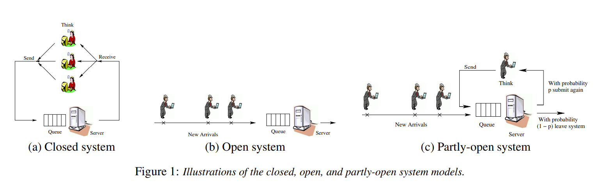

- https://citeseerx.ist.psu.edu/document?repid=rep1&type=pdf&doi=d08855653f9557b633304bb6d5b88d1a5b537302
- Workload generators:
	- **closed** system: a new job arrivals are only triggered by job completions (followed by **think time**),
	- **open** system: new jobs arrive independently of job completions
- eight principles
	- difference in mean response time under open and closed system models and how various parameters affect these differences
	- impact of scheduling on improving system performance
- {:height 174, :width 541}
- TODO MPL: ?
- scheduling policies
	- **FCFS** (First-Come-First-Served) Jobs are processed in the same order as they arrive
	- **PS** (Processor-Sharing) The server is shared evenly among all jobs in the system
	- **PESJF** (Preemptive-Expected-Shortest-Job-First) The job with the smallest expected duration (size) is given preemptive priority
	- **SRPT** (Shortest-Remaining-Processing-Time-First): At every moment the request with the smallest remaining processing requirement is given priority.
	- **PELJF** (Preemptive-Expected-Longest-Job-First) The job with the longest expected size is given preemptive priority. PELJF is an example of a policy that performs badly and is included to understand the full range of possible response times