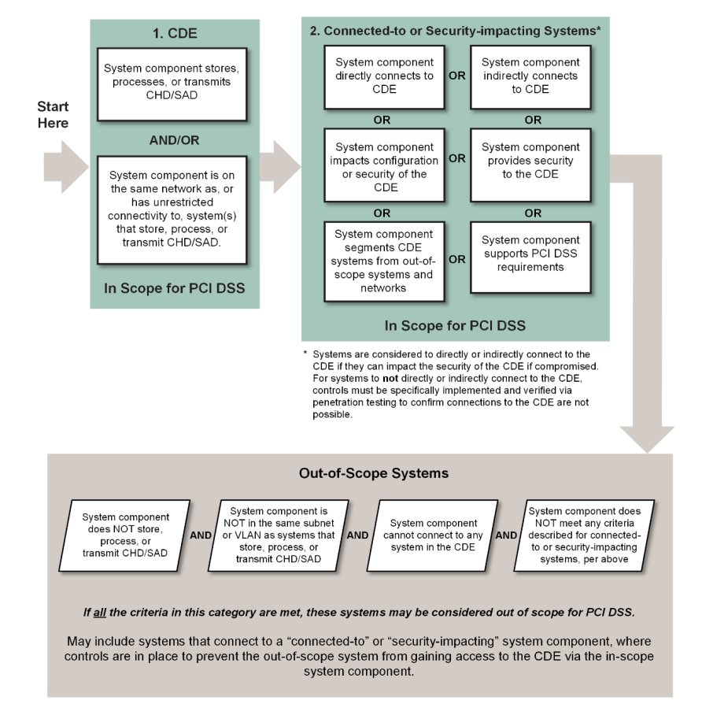

- PCI DSS provides a baseline of **technical** and **operational** ==requirements== designed to protect account data
- Principal PCI DSS Requirements
  | PCI Data Security Standard – High Level Overview | |
  | Build and Maintain a Secure Network and Systems     | 1. Install and Maintain Network Security Controls  2. Apply Secure Configurations to All System Components. |
  | Protect Account Data | 3. Protect Stored Account Data.  4. Protect Cardholder Data with Strong Cryptography During Transmission Over Open, Public Networks.|
  | Maintain a Vulnerability Management Program | 5. Protect All Systems and Networks from Malicious Software.  6. Develop and Maintain Secure Systems and Software. |
  | Implement Strong Access Control Measures | 7. Restrict Access to System Components and Cardholder Data by Business Need to Know  8. Identify Users and Authenticate Access to System Components  9. Restrict Physical Access to Cardholder Data.|
  | Regularly Monitor and Test Networks | 10. Log and Monitor All Access to System Components and Cardholder Data.  11. Test Security of Systems and Networks Regularly.|
  | Maintain an Information Security Policy | 12. Support Information Security with Organizational Policies and Programs|
- Account Data, Cardholder Data, and Sensitive Authentication Data
- Account Data
	- Cardholder Data includes:
		- Primary Account Number (PAN)
		- Cardholder Name
		- Expiration Date
		- Service Code: **Three-digit or four-digit value in the magnetic-stripe that follows the expiration date of the payment card on the track data**. It is used for various things such as defining service attributes, differentiating between international and national interchange, or identifying usage restrictions.
	- Sensitive Authentication Data includes:
		- Full track data (magnetic-stripe data or equivalent on a chip)
		- Card verification code
		- PINs/PIN blocks
- Account Data Element Storage Requirements
  <table border="1"><tr><td></td><td></td><th>Data Elements</th><th>Storage Restrictions</th><th>Required to Render Stored Data
  Unreadable</th></tr>
  <tr><td rowspan="7">Account Data</td><td rowspan="4">Cardholder Data</td><td>Primary Account Number (PAN)</td><td>Storage is kept to a minimum as defined in
  Requirement 3.2</td><td>Yes, as defined in Requirement 3.5</td></tr>
  <tr><td>Cardholder Name</td><td rowspan="3">Storage is kept to a minimum as defined in
  Requirement 3.2 Service Code</td><td rowspan="3">No</td></tr>
  <tr><td>Service Code</td></tr>
  <tr><td>Expiration Date</td></tr>
  <tr><td rowspan="3">Sensitive Authentication Data</td><td>Full Track Data</td><td rowspan="3">Cannot be stored after authorization as
  defined in Requirement 3.3.1 3</td><td rowspan="3">Yes, data stored until authorization is complete must be protected with strong cryptography as defined in Requirement 3.3.2</td></tr>
  <tr><td>Card verification code</td></tr>
  <tr><td>PIN/PIN Block</td></tr>
  </table>
- Understanding PCI DSS Scoping
  
- terms:
	- sensitive authentication data (SAD)
	- cardholder data (CHD)
	- cardholder data environment (CDE)
	- Payment Application Data Security Standard (PA-DSS): replaced by SSF
	- Software Security Framework (SSF): consists of the Secure Software Standard and the Secure Software Lifecycle (Secure SLC) Standard