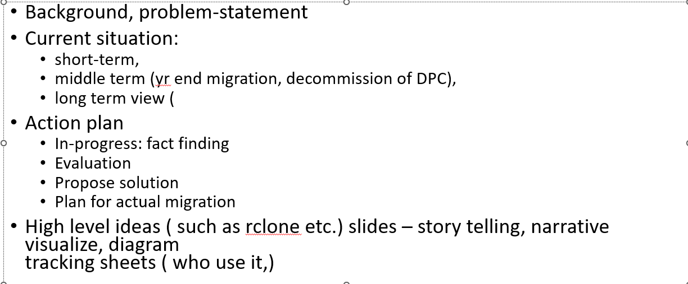

- problem statement
- 
- Shift, Ctrl, Alt key
- shape:
	- gradient, transparency, outline
	- edit points
- format painter, animation painter
- Pointer Option: laser point, pen, highlighter
- color, fonts,
- font-size:
	- https://www.brightcarbon.com/blog/presentation-font-size/
	- Comfortable Viewing Distance for Text on Presentation Visuals https://thinkoutsidetheslide.com/wp-content/uploads/2012/08/ViewingDistanceTable16x9.pdf
- design trends: pantone color of the year, accessibility: adobe, color contract checker.
- default: fonts, shape etc.
- change case:
- eyedropper
- animated chart (graph)
- timeline -- animation: across multiple slides
- join type
- skills:
	- Layout
	- Designing
	- Visual Heirarchy
	- Aesthetics
	- Copywriting
	- Storytelling
	- Presentation
	- Communication
	- Brand Design
	- Branding
-