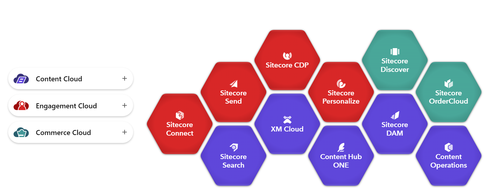

- CMS
- licenses: **licensing fee starts at $40,000 and is another $8,000 for each additional year**
- [Sitecore Experience Platform 10.0: downloads](https://dev.sitecore.net/Downloads/Sitecore_Experience_Platform/100/Sitecore_Experience_Platform_100.aspx)
- prods:
	- Sitecore Experience Manager (XM)
	- Sitecore Experience Platform (XP)
	- Sitecore Experience Commerce (XC)
	- Sitecore Experience Accelerator (SXA)
	- Federated Experience Manager (FXM)
	- Email Experience Manager (EXM)
	- Sitecore TDS: gives the Sitecore development team members the ability to use source control to keep track of all Sitecore items in a project.
- Sitecore Cortex Processing Engine: a worker role that performs data processing tasks
- Sitecore Layout Service: a [Sitecore Headless Services](https://doc.sitecore.com/xp/en/developers/100/developer-tools/sitecore-headless-services.html) endpoint that provides JSON formatted Sitecore content.
- Headless Services: (formerly the [JSS Server Components](https://jss.sitecore.com/)) provides the APIs needed for the [Sitecore ASP.NET Rendering SDK](https://doc.sitecore.com/xp/en/developers/100/developer-tools/sitecore-asp-net-rendering-sdk.html).
- Sitecore Rendering Engine: The Sitecore Rendering Engine renders content fetched from a Sitecore instance using the [Sitecore Layout Service](https://doc.sitecore.com/xp/en/developers/100/developer-tools/sitecore-layout-service.html). You must perform some configuration to use the Rendering Engine in your application. Most of this configuration is done in the `Startup` class.
- sitecore roles
	- CM: content management
	- CD: content delivery
	- REP: xDB Reporting Service (rep)
	- PRC: xDB Processing Service (prc)
	- si: Sitecore Identity (si)
- Sitecore Cargo Payload (SCCPL): a ZIP-based format for packaging and deploying Sitecore content and configuration. It is an extension of the standard ZIP format, with additional features that make it ideal for Sitecore deployments.
- Web Deploy Packages (WDP): contain the application code and resources required to deploy Sitecore as well as any associated modules (if required). During the packaging process, the content of the WDPs are transformed to ensure correct operation when they are deployed to Azure. These transformations are defined via Sitecore Cargo Payload (SCCPL) packages which SAT references during the packaging process.
- Experience Database (xDB)
- xConnect: the service layer that sits in between the xDB and any trusted client that wants to read, write, or search experience data using the [xConnect Client API](https://doc.sitecore.com/xp/en/developers/103/sitecore-experience-platform/xconnect-client-api-overview.html).
- XP
	- [Running Sitecore on Azure Kubernetes Service (AKS)](https://www.sitecore.com/knowledge-center/getting-started/running-sitecore-on-azure-kubernetes-service)
- [Sitecore Developer Trial Program](https://www.sitecore.com/knowledge-center/getting-started/developing-on-sitecore#chaptersection3)
- [Redirect non-www to www](https://community.sitecore.com/community?id=community_question&sys_id=50b5eb2d1b4770d0b8954371b24bcb9e)
- https://sitecore.stackexchange.com/questions/29592/is-there-a-url-rewrite-module-for-sitecore-10-1-0
- Managed Cloud with Containers (MCC)
- Sitecore Experience Accelerator (SXA)
- Email Experience Manager (EXM)
- Sitecore Installation Framework (SIF): The Sitecore Install Framework (SIF) enables users to deploy and configure a Sitecore environment using a standard configuration design that can be extended through custom PowerShell functions.
- SaaS DXP 
- [A Quick Guide on Setting up Branded Microsites in Sitecore](https://community.sitecore.com/community?id=community_user_profile&user=59b2e36d1b8370d0b8954371b24bcb28)