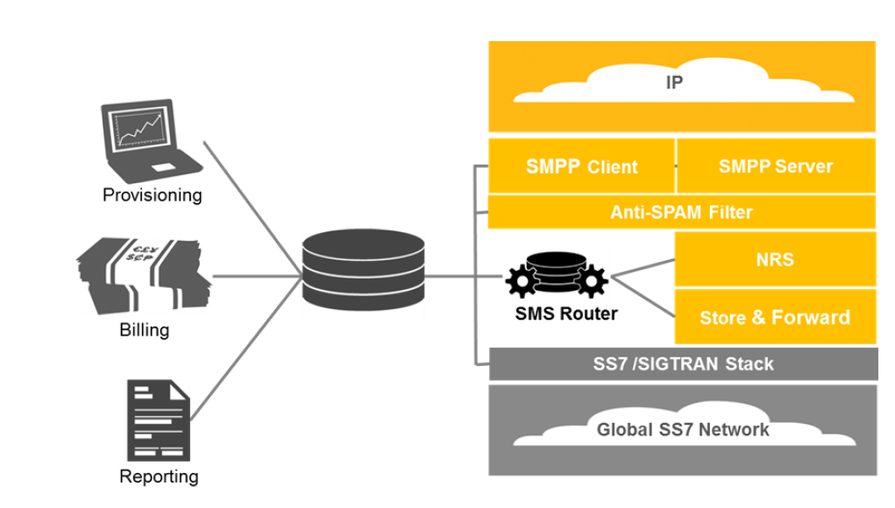

- SMSC: singtel, starhub
- [Wammu](https://wammu.eu/wammu/) is a program to manage data in your cell phone such as contacts, calendar or messages. [Gammu SMSD](https://wammu.eu/smsd/) is a service to mass send and receive SMS messages. Both these are built on top of [Gammu library](https://wammu.eu/libgammu/), which provides abstraction layer to work with different cell phones from different vendors (including Nokia, Sony-Ericsson, Motorola, Samsung, Siemens, Huawei and others).
- [SMSC3](https://github.com/mdouchement/smsc3): a SMSC simulator based on SMPP3.4. It allows to fake incoming and outgoing SMS.
- [SMPP SMSC Simulator](https://github.com/melroselabs/smpp-smsc-simulator): This code was previously used in an early version of the Melrose Labs [SMPP SMSC Simulator](https://melroselabs.com/services/smsc-simulator/) service. The SMSC simulator (or SMPP simulator) is used to test an SMS application's support for the [SMPP](https://smpp.org/) protocol and to simulate the delivery of SMS.
- Short Message Peer-to-Peer (SMPP): an open, industry standard protocol designed to provide a flexible data communications interface for the transfer of short message data between External Short Message Entities (ESME), Routing Entities (RE) and Message Centres (MC). The SMPP protocol is a means by which applications can send SMS messages to mobile devices and receive SMS from mobile devices.
- SS7 (C7)
- IPX
- MPLS
- **Mobile Application Part** (**MAP**): an [SS7](https://en.wikipedia.org/wiki/Signaling_System_7) [protocol](https://en.wikipedia.org/wiki/Communications_protocol) that provides an application layer for the various nodes in [GSM](https://en.wikipedia.org/wiki/GSM) and [UMTS](https://en.wikipedia.org/wiki/UMTS) [mobile core networks](https://en.wikipedia.org/wiki/Network_Switching_Subsystem) and [GPRS core networks](https://en.wikipedia.org/wiki/GPRS_Core_Network) to communicate with each other in order to provide services to users. The Mobile Application Part is the application-layer protocol used to access the Home Location Register, Visitor Location Register, Mobile Switching Center, Equipment Identity Register, Authentication Centre, [Short message service center](https://en.wikipedia.org/wiki/Short_message_service_center) and [Serving GPRS Support Node](https://en.wikipedia.org/wiki/SGSN) (SGSN).
- SMS 365
  {:height 419, :width 563}